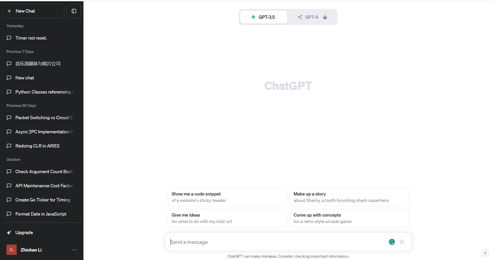

# Communicating Protocol

## Web Application to Server

### Requests

```html
POST /request?type={type}
```

|Fields|Notes|Description|
|---|---|---|
|type|```q```, ```h```, ```hs```|Query, History by uid, History by session id|
|token|From supabase|API key for user authentication, more [here](https://supabase.com/docs/learn/auth-deep-dive/auth-deep-dive-jwts)|
|uid||User ID|
|sid||Session ID - A user could have different chats with GPT|
|query|Nullable|When type is ```q```, this is a string of user input|
|timestamp||Timestamp of the Query|

### Returns

#### General Structure

```json
{
    "type": "q",
    "uid": 12,
    "results": {
        <session id>: [
            {
                "rid": 1,
                "result": "How can I assist you?",
                "timestamp": 1699282697
            }
        ], 
        <session id>: [
            ...
        ]
    }
}
```

#### Return When type=```q```

```json
{
    "type": "q",
    "uid": 12,
    "results": {
        <session id>: [
            {
                "rid": 2,
                "result": "How can I assist you?",
                "timestamp": 1699282697
            }
        ]
    }
}
```

#### Return when type=```h```

In this case, the web application is trying to get a list of all history chats and present them.



The data is used to create something like the side bar of ChatGPT, and the ```result``` field should return the first query, i.e. the first user input.

```json
{
    "type": "h",
    "uid": 12,
    "results": {
        "1": [
            {
                "rid": 1,
                "result": "Hello?",
                "timestamp": 1699282697
            }
        ],
        "2": [
            {
                "rid": 1,
                "result": "Give me the most recent bills about healthcare",
                "timestamp": 1699284430
            }
        ],
        ...
    }
}
```

#### Return when type=```hs```

```json
{
    "type": "h",
    "uid": 12,
    "results": {
        "1": [
            {
                "rid": 1,
                "result": "Hi! How may I assist you today?",
                "timestamp": 1699282697
            },
            {
                "rid": 2,
                "result": "Sure! Here are the most recent 10 bills about gun control in the past five years...",
                "timestamp": 1699282912
            },
            {
                "rid": 3,
                "result": "Here are the summaries of the second bill...",
                "timestamp": 1699282981
            }
        ]
    }
}
```
